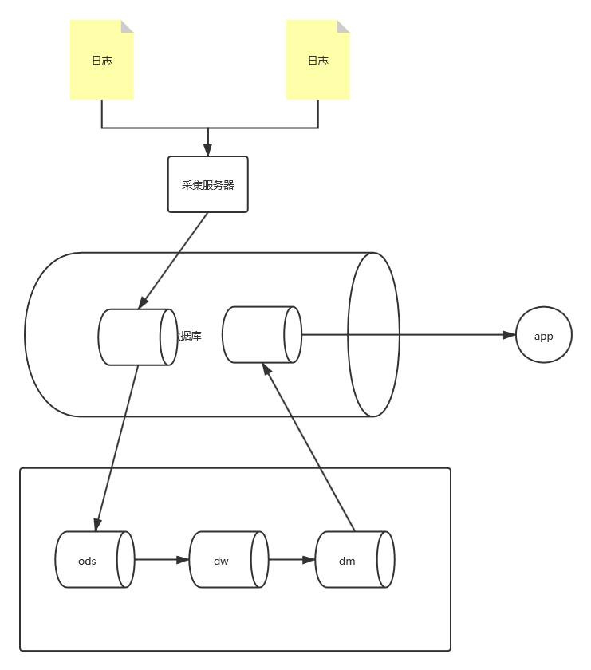

# 源数据提取

# 本地源数据推送

将日志采集的原始数据推送到数据平台ods层

> ods（Operational Data Store）操作性数据
>
> *特点*
>
> 1、结构源数据保持一致
>
> 2、一旦写入不能被修改

通过在数据平台建立数据集成任务，通过配置数据源，设置规则，即可将本地系统中指定表中数据集成到数据平台的ods层中。

# dw层数据建模

> dw（Data Warehouse）数据仓库，包含所有主题的通用数据集合。
>
> dw层模型一般分为两类，维度表和事实表。维度表描述对象，如项目信息。事实表描述对象行为信息，如单据信息。
>
> *特点*
>
> 1、应用数据都应该来自于dw层
>
> 2、只允许增加不允许删除和修改

这一步有两个目的：

1、建立对象模型，如果ods的数据是来自多个系统，将不同系统的相同主题域对象信息进行汇总。

2、按主题生成对象的事实表。（清楚ods中的无效字段，提高信息的颗粒度等）。

# dm层数据汇总

> dm（Data Mart）数据集市，为了特定的应用目的或应用范围，而从数据仓库中独立出来的一部分数据。
>
> *特点*
>
> 1、dm针对具体应用业务建立
>
> 2、dm间不相互依赖

dm中对dw的数据进行汇总，生成具体业务需要的数据

# dm层数据回写本地数据库

